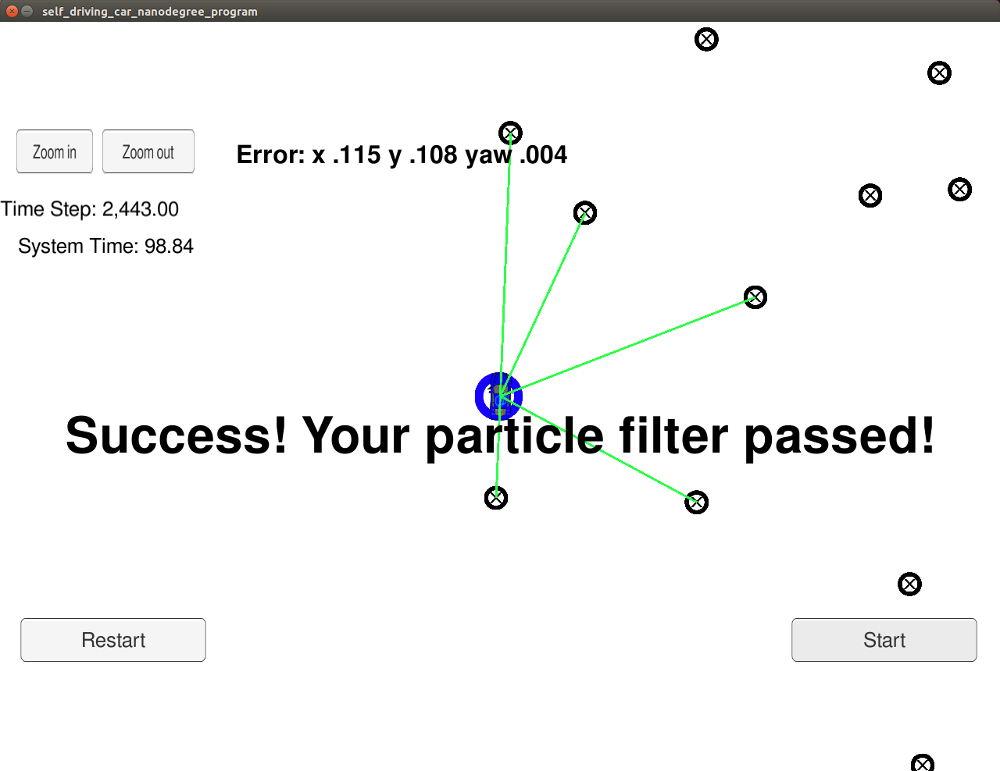

# ParticleFilterSDCN
Particle filter implementation for Udacity Self Driving Car Nanodegree

### Overview
This repository contains implementation of a particle filter for estimating the location of a kidnapped vehicle. Essentially, the vehicle has been kidnapped and transported to a new location. Luckily it has a map of this location, a (noisy) GPS estimate of its initial location, and lots of (noisy) sensor and control data. 

The project implements a 2-dimensional particle filter in C++. The filter gets the map of the area as input, together with some initial localization information (analogous to what a GPS would provide). At each time step the filter will also get observation and control data with noisy lidar and radar measurements. The performance of the filter can be visualized by using the simulator provided by Udacity.  

### C++ source files
We have the following C++ source files in the _src_ directory of the repository:

- helper_functions.f - This file contains definitions of some basic data structures, plus the functions to read control data, and the ground truth, landmark, control and map data.
- map.h - This file contains the definition of the class Map, which is essentially just a collection of landmarks defined with their IDs and locations. 
- json.hpp - This file contains all the JSON definitions we need for the project (and more), since JSON is the format used for passing information between our program and the Udacity simulator. 
- main.cpp - This is the main file of the program, which contains the main function. More details on the program flow and the algorithm is given below.  
- particle_filter.cpp and particle_filter.h - These files contain all the implementation code of the particle filter. More details on the content is given below. 

### main.cpp

### particle_filter.cpp

### Output from the program
The output of the program is monitored in the simulator screen. The screen shows the system time since the simulation has started, the number of time steps, and the error for the state variables x, y and yaw. The goal of the project is that the simulator run finishes within 100 seconds, and if it does and the errors are within the predefined range, the final screenshot from the run will look like the image below.  


 
 If the simulation runs out of time (for example because of too many particles used, which slows down the run), the message "You ran out of time" will appear on the screen after 100 seconds elapsed since the begining of the run. 
 
### How to run the program
After cloning this repository, simply execute the following commands to build and run the program:
```
./clean.sh
./build.sh
./run.sh
```
At the same time, the Udacity simulator needs to be running, so that the simulator and the UKF program connect and exchange information. 

### Setting up the environment 
- The project is configured to compile with cmake and make. Please make sure that the following dependencies are met:
   - cmake version 3.5
   - make version 4.1 for Linux and Mac and 3.81 for Windows
   - gcc/g++ version 5.4
- Download the Udacity simulator from [here](https://github.com/udacity/self-driving-car-sim/releases/)
- Additional libraries need to be installed by running:
   - On Ubuntu, install-ubuntu.sh 
   - On Mac, install-mac.sh
   - On Windows, the recommended way is to run a virtual machine and use the install-ubuntu.sh script
   
### More information
For even more information on the project structure, dependencies etc. please check original Udacity project [repository](https://github.com/udacity/CarND-Kidnapped-Vehicle-Project)
